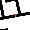
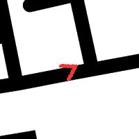

# Reinforcement-Learning-TD3-
Implement TD3 algorithm to train a car to move across two destinations on a map


### State Dimensions
----------------------

 - **Image** - A crop of 200x200 image of the mask where the car is present.This will act as the visual input to the actor and critic model. An arrow is superimposed on top of the crop and resized to 30x30 and then fed to the network.

   

- **Orientation** - Orientation is calculated based on the shift in the angle between the car and the goal. Both +ve orientation and -ve orientation is sent to the network for stability.

- **Distance** - Distance from the car to the goal is calculated by Euclidian distance and is also passed as a state parameter.

### Action Dimensions 
-----------------------
- **Rotation** - The actor model and actor target predicts a float value that represents the angle of rotation for the car. 
The range of values for rotation are - `[-5,5]`

- **Velocity** - The x-axis component of the velocity is predicted by the model. Velocity along with rotation angle makes up the action parameters that help move the car forward. 
The range of values for velocity are - `[0,3]`

### Terminal Condition (done = True)
-----------------------
- **Positive Terminal** - When the car reaches the goal, positive terminal condition is met, `done = True` and `goal_reward = 500`. A large goal is necessary because if the goal reward is small, the car just keeps circling around the goal to accumulate more reward until time limit is reached.
- **Negative Terminal** - If the car hits the wall, `wall_reward = -100`
- **Time Limit** - If the car takes more than `2000` steps to reach the goal (or) complete an episode, then `time_reward = -100`

### Reward Function
- **Distance reward** - We want to keep a continuous reward function to help the model give feedback at regular intervals as opposed to a sparse/binary reward.
`distance_reward = 1 - (distance/const)**0.2` 
const is kept as 1429 to bring the distance parameter to [0,1] range. This type of function ensures that large reward is given if car is near to goal and small values if the car is farther. This reward function will always give a positive reward ensuring that the policy model does not learn to maximize reward by hitting the wall as soon as possible instead of going towards the goal acumulating rewards overtime. The steep increase  for smaller values of distance is intentional, this makes sure that the car moves precisely towards the goal.

- **Velocity reward** - The range of value predicted for velocity is between 0 and 3, but we want the car to go slower when it is on sand which would result in decrease of overall reward and hence encouraging the agent to always be on the road. Velicity predicted is normalised to be in the range of [0,1] and is multiplied by a discounting factor (road factor) to alter the speed.
- **Road factor** - We take the average of the pixel values (20,10) where the car is present at that particular state. If majority of the car portion is on the road, we get a value closer to 0, if the car is on sand, we get a value closer to 1. This will be used as a multiplying factor along with distance reward as well as velocity reward.
```road_factor = 1 - np.average(sand_pixels)```
- **Rotation reward** If the car starts to rotate at the same point, every time it rotates by 360 degrees, we penalise it. This is to discourage the agent to get stuck and rotate at the same point.
 `rotation_reward = -0.1*(self.car.angle//360)`
- **Living reward** - We want the car to go to the destination as quickly as posible. Also to encourage the agent to take the shorter route, we add a constant living penalty.
`living_reward = -0.1`

- The final reward function is a combination of all these rewards - 
```reward = (distance_reward * road_factor) + (velocity * road_factor) + rotation_reward + living_reward + wall_reward + goal_reward + time_reward```

#### Conclusion 
Although I was able to get the car going in the right direction, keeping the car on track still seems to be a challenge. Maybe the reward function has too many parameters for it to be effective. I will continue to experiment with reward function to get it to drive on road.

#### Limitations
- Training on a CPU is really challenging, need to port this project to gym env and run it on colab
- Tried a lot of things to keep the car on road,it still doesn't stick on road. Need to experiment more to get it working. Image size 30x30 may be too small to figure out where the car is, I used 30x30 and batch_size of 50 because of resource constraint.
- Car still occasionally rotates (Ghoomar effect). My hunch is that reward function is causing it to do so, need to investigate.
